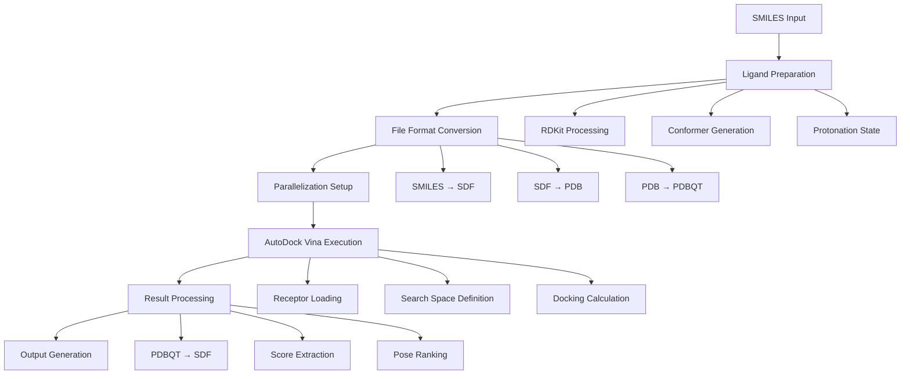

# AutoDock Vina Pipeline Flow in DockStream: Complete Software Functioning Analysis

## Overview

This document provides a comprehensive analysis of the AutoDock Vina pipeline implementation in DockStream, detailing the complete flow of software functioning from input to output, including file format conversions, parallelization, and execution workflow.

## Table of Contents

1. [High-Level Pipeline Overview](#high-level-overview)
2. [Detailed Component Flow](#detailed-flow)
3. [File Format Conversions](#file-formats)
4. [Parallelization Strategy](#parallelization)
5. [Software Dependencies](#dependencies)
6. [Configuration Parameters](#configuration)
7. [Error Handling and Validation](#error-handling)
8. [Performance Considerations](#performance)

## 1. High-Level Pipeline Overview {#high-level-overview}



## 2. Detailed Component Flow {#detailed-flow}

### 2.1 Entry Point: docker.py

**File**: `DockStream-master/docker.py`

**Function**: Main entry point for DockStream execution

**Key Operations**:
1. **Configuration Loading**: Reads JSON configuration file
2. **Backend Validation**: Ensures AutoDock Vina is specified
3. **Logger Initialization**: Sets up logging system
4. **Docker Instantiation**: Creates AutodockVina object
5. **Molecule Addition**: Processes SMILES input
6. **Execution**: Calls `docker.dock()`
7. **Output Handling**: Manages poses and scores output

**Code Flow**:
```python
# Main execution sequence
config_dict = load_configuration(args.conf)
logger = initialize_logging(config=config_dict)
docker = AutodockVina(**config_dict)

if args.smiles:
    smiles_list = args.smiles.split(';')
    ligands = [Ligand(smi, None, None) for smi in smiles_list]
    docker.add_molecules(ligands)

docker.dock()
handle_poses_writeout(docking_run=config_dict, docker=docker)
handle_scores_writeout(docking_run=config_dict, docker=docker)
```

### 2.2 AutodockVina Class Initialization

**File**: `dockstream/core/AutodockVina/AutodockVina_docker.py`

**Key Components**:
- **Parameters Validation**: Validates receptor path, search space, etc.
- **Executor Setup**: Initializes AutoDock Vina and OpenBabel executors
- **Ligand Storage**: Manages ligand list for processing

**Parameters Structure**:
```python
class AutodockVinaParameters(BaseModel):
    prefix_execution: Optional[str] = None
    binary_location: Optional[str] = None
    parallelization: Optional[Parallelization]
    receptor_pdbqt_path: Optional[List[str]] = None
    search_space: SearchSpace
    seed: int = 42
    number_poses: int = 1
    local_only: bool = False
    score_only: bool = False
```

### 2.3 Ligand Preparation Pipeline

**File**: `dockstream/core/ligand_preparator.py`

**Process Flow**:
1. **Input Validation**: Ensures ligand list is not empty
2. **Tautomer Enumeration**: Optional tautomer generation
3. **Stereoisomer Enumeration**: Optional stereochemistry enumeration
4. **Transformations**: Optional SMIRKS transformations
5. **Conformer Generation**: 3D structure generation

**Supported Preparators**:
- **RDKit**: Open source, default choice
- **OpenEye**: Proprietary (commented out in current version)
- **Corina**: Commercial
- **Ligprep**: Schrödinger suite
- **Omega**: OpenEye conformer generator

### 2.4 File Format Conversion Workflow

**Primary Conversion Chain**:
```
SMILES → RDKit Mol → SDF → PDB → PDBQT (Ligand)
PDB → PDBQT (Receptor, with -xr flag)
```

**Ligand Conversion Process**:
```python
# Step 1: SMILES to RDKit Mol (internal)
mol = Chem.MolFromSmiles(smiles)

# Step 2: RDKit Mol to PDB (temporary)
temp_pdb = gen_temp_file(suffix=".pdb")
Chem.MolToPDBFile(mol=molecule, filename=temp_pdb)

# Step 3: PDB to PDBQT using OpenBabel
arguments = [temp_pdb,
             "-opdbqt",  # Output format
             "-O", path,  # Output path
             "--partialcharge", "gasteiger"]  # Charge calculation
self._OpenBabel_executor.execute(command="obabel", arguments=arguments)
```

**Receptor Conversion Process**:
```python
# PDB to PDBQT with receptor-specific flags
arguments = [temp_target_pdb,
             "-opdbqt",
             "-O", path,
             "-xr",  # Disable tree construction (static receptor)
             "-p", pH,  # Protonation state
             "--partialcharge", "gasteiger"]
```

### 2.5 Parallelization Strategy

**File**: `dockstream/core/docker.py` and `utils/parallelization/general_utils.py`

**Parallelization Logic**:
1. **Core Count Determination**: Uses available CPU cores or user-specified
2. **Ligand Splitting**: Divides ligands into sublists
3. **Process Creation**: Creates separate processes for each sublist
4. **Synchronization**: Waits for all processes to complete

**Splitting Algorithm**:
```python
def split_into_sublists(input_list, partitions=None, slice_size=None):
    if partitions is not None:
        chunk_size = int(math.ceil(len(input_list) / partitions))
    else:
        chunk_size = slice_size
    
    for i in range(0, len(input_list), chunk_size):
        start_indices.append(i)
        return_list.append(input_list[i:i + chunk_size])
    return start_indices, return_list
```

**Process Execution**:
```python
# Create parallel processes
processes = []
for chunk_index in range(len(tmp_output_dirs)):
    p = multiprocessing.Process(target=self._dock_subjob, 
                               args=(tmp_input_paths[chunk_index],
                                    tmp_output_pdbqt_paths[chunk_index],
                                    tmp_output_paths[chunk_index],
                                    tmp_stdout_paths[chunk_index]))
    processes.append(p)
    p.start()

# Wait for completion
for p in processes:
    p.join()
```

## 3. File Format Conversions {#file-formats}

### 3.1 Input Format Processing

**SMILES Processing**:
- **Source**: Command line (`-smiles`) or configuration file
- **Parsing**: Split by semicolon (`;`) for multiple SMILES
- **Validation**: RDKit molecule validation

**SDF Processing**:
- **Reading**: RDKit SDF reader
- **Validation**: Molecule structure validation
- **Conformer Handling**: Multiple conformers supported

### 3.2 Intermediate Format Conversions

**SMILES → SDF**:
```python
# RDKit conversion
mol = Chem.MolFromSmiles(smiles)
writer = Chem.SDWriter('output.sdf')
writer.write(mol)
```

**SDF → PDB**:
```python
# RDKit conversion
Chem.MolToPDBFile(mol=molecule, filename=temp_pdb)
```

**PDB → PDBQT**:
```python
# OpenBabel conversion with specific flags
obabel input.pdb -opdbqt -O output.pdbqt --partialcharge gasteiger
```

### 3.3 Output Format Processing

**PDBQT → SDF**:
```python
# Post-docking conversion back to SDF
arguments = [tmp_pdbqt_docked,
             "-ipdbqt",  # Input format
             "-osdf",    # Output format
             "-O", output_path_sdf]
self._OpenBabel_executor.execute(command="obabel", arguments=arguments)
```

## 4. AutoDock Vina Execution Details {#execution}

### 4.1 Command Construction

**Core Vina Command**:
```python
arguments = [
    "--receptor", self.parameters.receptor_pdbqt_path[0],
    "--ligand", input_path_pdbqt,
    "--cpu", str(1),  # Single CPU per process
    "--seed", self.parameters.seed,
    "--out", tmp_pdbqt_docked,
    "--center_x", str(search_space.center_x),
    "--center_y", str(search_space.center_y),
    "--center_z", str(search_space.center_z),
    "--size_x", str(search_space.size_x),
    "--size_y", str(search_space.size_y),
    "--size_z", str(search_space.size_z),
    "--num_modes", self.parameters.number_poses
]

# Optional flags
if self.parameters.local_only:
    arguments.append("--local_only")
if self.parameters.score_only:
    arguments.append("--score_only")
```

### 4.2 Execution Process

**Single Subjob Execution**:
```python
def _dock_subjob(self, input_path_pdbqt, output_path_pdbqt, 
                 output_path_sdf, output_stdout_txt):
    # 1. Execute AutoDock Vina
    execution_result = self._ADV_executor.execute(command="vina",
                                                  arguments=arguments,
                                                  check=True)
    
    # 2. Save stdout output
    stdout = open(output_stdout_txt, 'w')
    stdout.write(execution_result.stdout)
    stdout.close()
    
    # 3. Convert PDBQT to SDF
    arguments = [tmp_pdbqt_docked, "-ipdbqt", "-osdf", "-O", output_path_sdf]
    self._OpenBabel_executor.execute(command="obabel", arguments=arguments)
```

### 4.3 Search Space Configuration

**Search Space Parameters**:
- **Center**: X, Y, Z coordinates of binding site center
- **Size**: X, Y, Z dimensions of search box (in Angstroms)
- **Validation**: Ensures reasonable box dimensions

**Example Configuration**:
```json
"search_space": {
    "--center_x": 3.3,
    "--center_y": 11.5,
    "--center_z": 24.8,
    "--size_x": 15,
    "--size_y": 10,
    "--size_z": 10
}
```

## 5. Software Dependencies {#dependencies}

### 5.1 Core Dependencies

**AutoDock Vina**:
- **Version**: 1.2.3 (included in DockStream)
- **Location**: `DockStreamCommunity/AutoDock-Vina-1.2.3/`
- **Binary**: Platform-specific executable
- **Function**: Molecular docking calculations

**OpenBabel**:
- **Purpose**: File format conversions
- **Key Functions**: PDB ↔ PDBQT ↔ SDF conversions
- **Charge Calculation**: Gasteiger partial charges
- **Installation**: Conda/pip installable

**RDKit**:
- **Purpose**: Molecule handling and conformer generation
- **Functions**: SMILES parsing, SDF I/O, PDB generation
- **Integration**: Primary chemistry toolkit

### 5.2 Python Dependencies

**Core Libraries**:
```python
import multiprocessing  # Parallelization
import subprocess      # External command execution
import os, sys        # File system operations
import tempfile       # Temporary file management
from rdkit import Chem # Molecule handling
from pydantic import BaseModel  # Configuration validation
```

**DockStream Modules**:
```python
from dockstream.core.docker import Docker
from dockstream.utils.execute_external.AutodockVina import AutodockVinaExecutor
from dockstream.utils.execute_external.OpenBabel import OpenBabelExecutor
from dockstream.utils.parallelization.general_utils import split_into_sublists
```

## 6. Configuration Parameters {#configuration}

### 6.1 Complete Configuration Structure

```json
{
    "ligand_preparation": {
        "type": "RDkit",
        "target_ph": 7.4,
        "ph_tolerance": 1.0
    },
    "docking_runs": [{
        "backend": "AutoDockVina",
        "run_id": "AutoDockVina_run",
        "input_pools": ["RDkit_pool"],
        "parameters": {
            "binary_location": "/path/to/vina",
            "parallelization": {
                "number_cores": 4,
                "max_compounds_per_subjob": 100
            },
            "seed": 42,
            "receptor_pdbqt_path": ["/path/to/receptor.pdbqt"],
            "number_poses": 2,
            "search_space": {
                "--center_x": 3.3,
                "--center_y": 11.5,
                "--center_z": 24.8,
                "--size_x": 15,
                "--size_y": 10,
                "--size_z": 10
            },
            "local_only": false,
            "score_only": false
        },
        "output": {
            "poses": {
                "poses_path": "/path/to/output.sdf",
                "overwrite": true,
                "mode": "best_per_ligand"
            },
            "scores": {
                "scores_path": "/path/to/scores.csv",
                "overwrite": true
            }
        }
    }]
}
```

### 6.2 Parameter Descriptions

**Parallelization Parameters**:
- `number_cores`: Number of CPU cores to use
- `max_compounds_per_subjob`: Maximum ligands per parallel process

**Docking Parameters**:
- `seed`: Random seed for reproducibility
- `number_poses`: Number of poses to generate per ligand
- `local_only`: Perform local optimization only
- `score_only`: Score existing poses without docking

**Search Space Parameters**:
- `center_x/y/z`: Binding site center coordinates
- `size_x/y/z`: Search box dimensions (Angstroms)

## 7. Error Handling and Validation {#error-handling}

### 7.1 Input Validation

**Receptor Validation**:
```python
if not os.path.exists(self.parameters.receptor_pdbqt_path[0]):
    raise DockingRunFailed("Specified PDBQT path to target (receptor) does not exist")
```

**Ligand Validation**:
```python
if len(self.ligands) == 0:
    raise LigandPreparationFailed("Specify at least one ligand")
```

**Backend Validation**:
```python
backend = config_dict["backend"].upper()
if backend != "AUTODOCKVINA":
    raise BackendNotAvailableException("Only AutoDock Vina is supported")
```

### 7.2 File System Delays

**File System Synchronization**:
```python
def _delay4file_system(self, path):
    # Wait for file system to catch up
    # Important for network file systems
    time.sleep(0.1)
    while not os.path.exists(path):
        time.sleep(0.1)
```

### 7.3 Process Error Handling

**Execution Error Handling**:
```python
try:
    execution_result = self._ADV_executor.execute(command="vina",
                                                  arguments=arguments,
                                                  check=True)
except subprocess.CalledProcessError as e:
    self._logger.log(f"Vina execution failed: {e}", LogLevel.ERROR)
    return False
```

## 8. Performance Considerations {#performance}

### 8.1 Parallelization Strategy

**Process-Level Parallelization**:
- Each ligand processed in separate process
- Avoids Python GIL limitations
- Memory isolation between processes

**Resource Management**:
- CPU cores: Configurable, defaults to available cores
- Memory: Each process handles single ligand
- I/O: Temporary files for inter-process communication

### 8.2 File I/O Optimization

**Temporary File Management**:
```python
# Efficient temporary file creation
tmp_pdbqt = gen_temp_file(suffix=".pdbqt", dir=working_dir)
tmp_sdf = gen_temp_file(suffix=".sdf", dir=working_dir)

# Cleanup after processing
if os.path.exists(temp_file):
    os.remove(temp_file)
```

**Batch Processing**:
- Configurable batch sizes via `max_compounds_per_subjob`
- Balance between parallelization and overhead
- Memory usage optimization

### 8.3 Scalability Considerations

**Large Dataset Handling**:
- Streaming processing for large SMILES files
- Configurable memory limits
- Progress tracking and logging

**Network File System Compatibility**:
- File system delay handling
- Robust file existence checking
- Temporary directory management

## 9. Complete Execution Flow Summary

### 9.1 Step-by-Step Process

1. **Initialization**
   - Load configuration from JSON
   - Validate parameters and paths
   - Initialize logging system

2. **Ligand Preparation**
   - Parse SMILES input
   - Generate 3D conformers (RDKit)
   - Apply protonation states

3. **File Conversion**
   - Convert SMILES → SDF → PDB → PDBQT
   - Apply Gasteiger charges
   - Validate file formats

4. **Parallelization Setup**
   - Split ligands into sublists
   - Create temporary directories
   - Generate process arguments

5. **Docking Execution**
   - Launch parallel Vina processes
   - Monitor process completion
   - Handle execution errors

6. **Result Processing**
   - Convert PDBQT → SDF
   - Extract binding scores
   - Rank poses by energy

7. **Output Generation**
   - Write poses to SDF files
   - Generate CSV score files
   - Clean up temporary files

### 9.2 Data Flow Diagram

```
Input SMILES
     ↓
[RDKit Processing]
     ↓
Temporary PDB Files
     ↓
[OpenBabel Conversion]
     ↓
PDBQT Ligand Files
     ↓
[AutoDock Vina Execution] ← Receptor PDBQT
     ↓
PDBQT Result Files
     ↓
[OpenBabel Conversion]
     ↓
SDF Output Files + CSV Scores
```

This comprehensive pipeline ensures robust, scalable, and efficient molecular docking using open-source tools while maintaining compatibility with various input formats and providing extensive configuration options.
